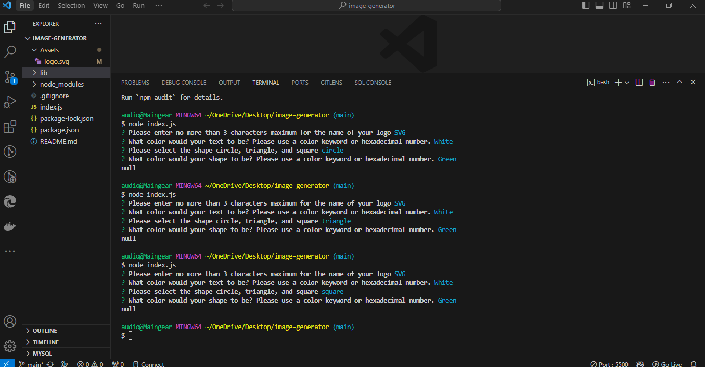

# Image Generator

## Description

Your task is to build a Node.js command-line application that takes in user input to generate a logo and save it as an [SVG file](https://en.wikipedia.org/wiki/Scalable_Vector_Graphics). The application prompts the user to select a color and shape, provide text for the logo, and save the generated SVG to a `.svg` file.

Because this application won’t be deployed, you’ll need to provide a link to a walkthrough video that demonstrates its functionality and passes all of the tests. You’ll need to submit a link to the video **and** add it to the README of your project.

### User Story

```md
AS a freelance web developer
I WANT to generate a simple logo for my projects
SO THAT I don't have to pay a graphic designer
```

## Acceptance Criteria

```md
GIVEN a command-line application that accepts user input
WHEN I am prompted for text
THEN I can enter up to three characters
WHEN I am prompted for the text color
THEN I can enter a color keyword (OR a hexadecimal number)
WHEN I am prompted for a shape
THEN I am presented with a list of shapes to choose from: circle, triangle, and square
WHEN I am prompted for the shape's color
THEN I can enter a color keyword (OR a hexadecimal number)
WHEN I have entered input for all the prompts
THEN an SVG file is created named `logo.svg`
AND the output text "Generated logo.svg" is printed in the command line
WHEN I open the `logo.svg` file in a browser
THEN I am shown a 300x200 pixel image that matches the criteria I entered
```

## Mock-Up

The following image shows a mock-up of the generated SVG given the following input entered by the user: `SVG` for the text, `white` for the text color, `circle` from the list of shapes, and `green` for the shape color. Note that this is just an image of the output SVG and not the SVG file itself:



## Motivation

This application demonstrates uses an inquirer package to prompt the user for input from the command line to generate a .svg image then creates a file with the image and saves it in the local directory. It also demonstrates the use of Jest for testing.

## Why

I was motivated to complete this project because it is a good introduction to using Node.js and the inquirer package to prompt the user for input from the command line. It also demonstrates the use of Jest for testing.

## What problem does it solve

This application solves the problem of having to pay a graphic designer to create a logo for a project.

## What did I learn

I learned how to use the inquirer package to prompt the user for input from the command line. I also learned how to write tests for JavaScript code using Jest. Jest can is a JavaScript testing framework designed to ensure correctness of any JavaScript codebase. It allows you to write tests with an approachable, familiar, and feature-rich API that gives you results quickly. Jest is well-documented, requires little configuration and can be extended to match your requirements.

## What makes this project stand out

This project stands out because it demonstrates the use of the inquirer package, node.js, and jest on an intruductory level. It is teaching me how to use these tools for creative purposes I can use to build on in the future.

## Instructions

First, youll need to clone the repository to your local machine. Then, youll need to install the inquirer package, "npm i inquirer@8.2.4" and jest, "npm i jest". Once you have the repository cloned and the packages installed, you can run the application by typing, "node index.js" in the command line. You will be prompted to enter text, text color, shape, and shape color. Once you have entered all the information, the application will generate a .svg file with the information you entered. You can then open the .svg file in your browser to view the image.

## Usage

This application is used to generate a logo for a project. It can be used by anyone who needs a logo for a project.

### Link to github repo

<https://github.com/precisecoding/image-generator>

### Link to walkthrough video

<https://drive.google.com/file/d/1LwA6vidUGSrKbUTc-ZV6XkMCHxpq9z3t/view>

### License

MIT License:
<https://opensource.org/licenses/MIT>
<https://choosealicense.com/licenses/mit/>
LICENSE file included in repository.

### Thanks for your support and contributions

Sources used: <https://developer.mozilla.org/en-US/>, <https://www.w3schools.com/>, <https://stackoverflow.com/>
